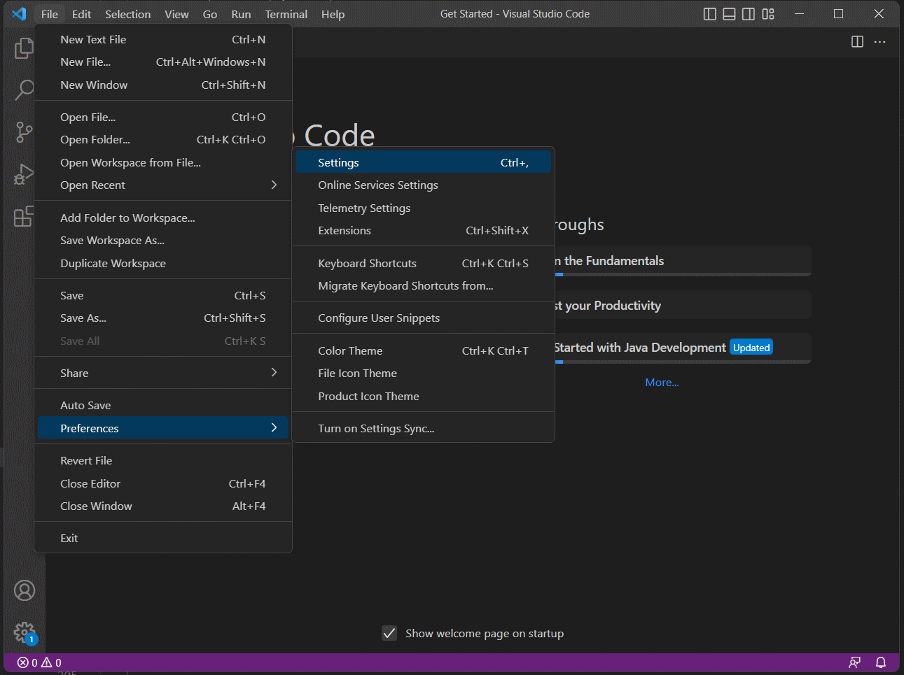
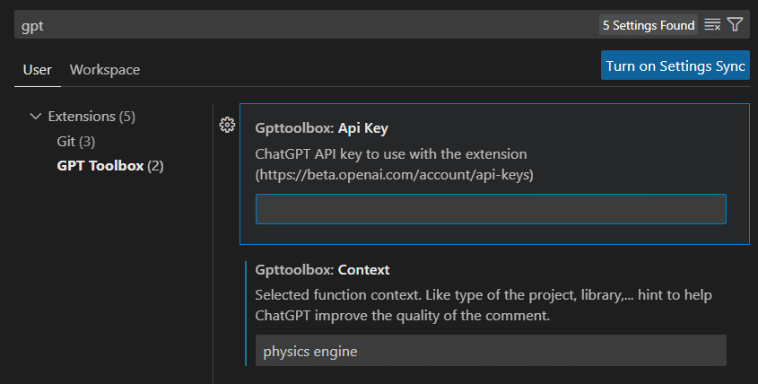
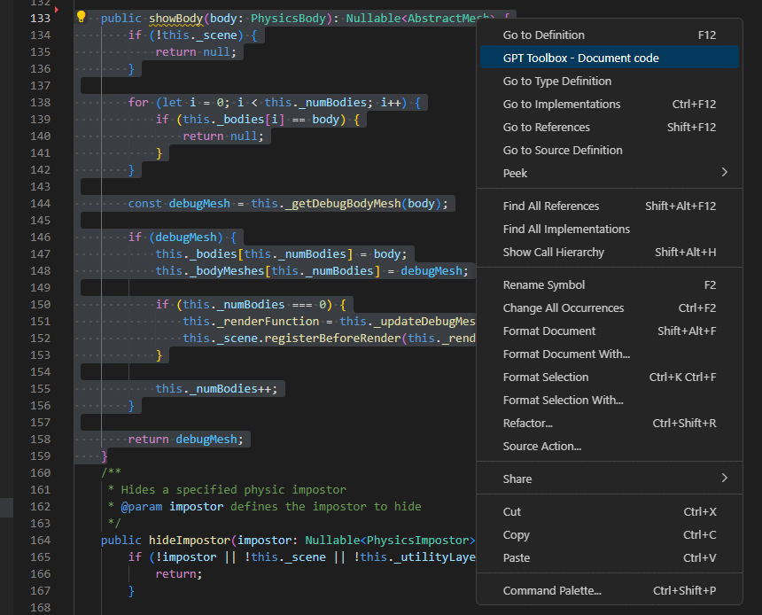
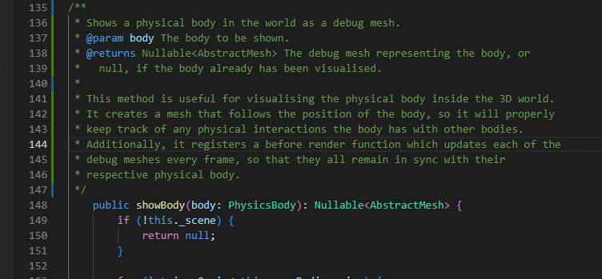

# GPT-Toolbox
GPT extension for VSCode. 
Generic interface and queries to use with Chat-GPT.
Main feature is documenting selected code.
With more functionalities expected to land in this project.

## Disclaimers:

> :warning: **Code sent and chat API host**: The selected code will be sent to the ChatGPT host. Make sure you are allowed to do so. If your code is private, you may not have the rights to send it to a 3rd Party. 

This extension has been tested mostly on Typescript code. Documentation quality with other languages may vary.

## Running this extension

- Run `npm install` in terminal to install dependencies
- Run the `Run Extension` target in the Debug View. This will:
	- Start a task `npm: watch` to compile the code
	- Run the extension in a new VS Code window

## Settings
Add your own ChatGPT API Key and an optional hint to help ChatGPT generate the comment.
Go to VSCode preferences:

Then fill the API key that you can get from https://beta.openai.com/account/api-keys

You can now also change the host instead of using OpenAI api. In the case you have a private instance of ChatGPT.

## How to use

Select your Typescript code in VScode then right click and select 'GPT Toolbox - Document code'

After a few seconds, the documentation comment is there.

